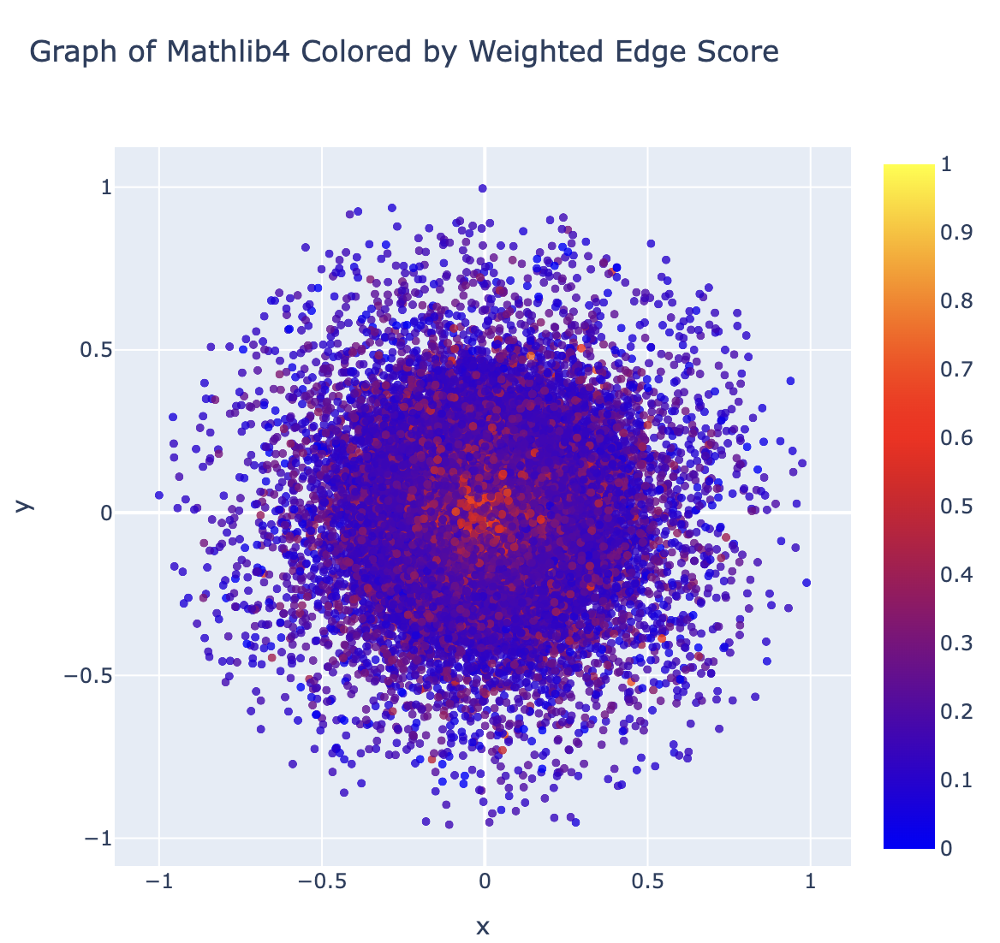

<h1 align="center">Lean-KG 🌪️</h1>

<p align="center">
  <a href="https://rjain2470.github.io/lean-kg/lean-kg-demo.html">
    
  </a>
</p>

<p align="center">
  <em>Interactive sample dependency graph of <code>mathlib4</code> (20k nodes). Click on the image to explore!</em>
</p>


A Python library designed to generate and visualize the dependency graph of the collection of theorems formalized in Lean.

## About The Project 📈
We compile the collection of theorems in mathlib4, a massive collection of formal statements in Lean, together with their proofs. We then parse the proofs of each theorem for instances of other theorems to uncover dependencies, and store this data in a massive multi-directed graph G. We can then (i) extract subgraphs of G representing sublibraries in mathlib4 (e.g. GroupTheory, MeasureTheory, Topology, etc.), (ii) plot G as an interactive colored graph in 2D space using the Plotly library, and (iii) embed G in N-dimensional space using PyKEEN to analyze the hierarchical and relational structure of the library.

## Getting Started 🚀

### Installation ✨
The required libraries to use the <code>lean-kg</code> package are as follows.
- pykeen[all]
- numpy
- scipy
- pandas
- torch
- networkx
- matplotlib
- plotly
- google-colab (if you are running on Colab)

You can import all of the required libraries with the following code snippet.
```python
!pip install -q pykeen[all] # Install pykeen and mathlib4
!git clone https://github.com/leanprover-community/mathlib4.git

# imports
import pathlib, os, re, logging, multiprocessing, matplotlib, numpy as np, random
import matplotlib.pyplot as plt, csv, networkx as nx, torch, pandas as pd
import plotly.graph_objects as go, matplotlib.cm as cm, matplotlib.colors as mcolors
import plotly.express as px
from plotly.subplots import make_subplots
from collections import deque
from scipy.optimize import minimize
from matplotlib.cm import get_cmap
from google.colab import files
from typing import Iterable, Union, List, Tuple
from pykeen.pipeline import pipeline
from pykeen.triples import TriplesFactory

EPS = 1e-9  # epsilon for numerical safety
```
To download <code>lean-kg</code> itself, you must run the following code snippet.
```bash
pip install -i https://test.pypi.org/simple/ lean-kg
```

## Usage 🤖

Here is a basic sample implementation of the package, assuming all relevant libraries are imported:
```python
import lean_kg

# Example: Build a dependency graph
G_full = lean_kg.build_dependency_graph("mathlib4/Mathlib", num_workers=4) # Builds full dependency graph
G_sample = lean_kg.expand_sample_graph(G_full, k=1000, max_nodes=1000) # Samples a random subgraph of 1000 nodes
G_group = lean_kg.extract_subgraph_by_subdir(G_full, "GroupTheory") # Extracts subgraph of statements from Group Theory

# Example: Plot interactive graph on the Euclidean plane
fig = lean_kg.plot_euclidean_graph(G, color_by="weighted_edges")
fig.show()

# Example: Train a knowledge graph embedding (set hyperparameters beforehand).
result = train_knowledge_graph_embedding(
     G,
     MODEL_NAME, # example: BoxE, RotateE, ConvE...
     EMB_DIM,
     EPOCHS,
     BATCH_SIZE,
     SEED,
     'cuda' if torch.cuda.is_available() else 'cpu'
 )
lean_kg.summarize_pykeen_metrics(result.metric_results.to_dict()) # Outputs performance metrics of the embedding (MR, MRR, Hits@k)
```
## Limitations 🚩
As of July 2025, <code>lean-kg</code> is only available on TestPyPI, and is still in development.

## License ⚖️
Distributed under the MIT License. See LICENSE.txt for more information.

## Contact 📞
Ritik Jain - https://www.linkedin.com/in/ritik-jain-91a201220/ - rjain92682@gmail.com
